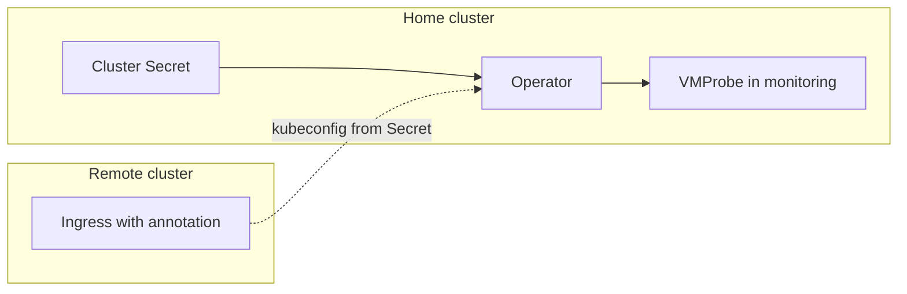

# blackbox-probe-controller

Kubernetes operator that watches **Ingress** resources in multiple remote clusters and manages [**VMProbe**](https://docs.victoriametrics.com/operator/resources/vmprobe/) objects in a single **home** cluster for [blackbox](https://github.com/prometheus/blackbox_exporter) monitoring via VictoriaMetrics.

## How it works



1. You deploy the operator in the **home** cluster (where VictoriaMetrics / VMAgent runs).
2. For each monitored cluster you create a **Secret** with a kubeconfig and a cluster name.
3. The operator connects to remote API servers and watches Ingress objects annotated for probing.
4. For each pair `(cluster, ingress namespace)` it creates or updates one **VMProbe** in the `monitoring` namespace (by default), with static targets and relabeling (`exported_cluster`, `namespace`, `host`, …).

Ingress in remote clusters are **not** watched via your local `~/.kube/config`; only the home cluster uses the default kubeconfig. Remote access is always through Secrets.

## Prerequisites

### Home cluster

- Kubernetes **1.25+**
- [VictoriaMetrics Operator](https://docs.victoriametrics.com/operator/) installed
- CRD `VMProbe` (`operator.victoriametrics.com/v1beta1`)
- Namespace for VMProbes (default: `monitoring`)
- Blackbox exporter reachable from VMAgent (default URL: `blackbox.monitoring.svc:9115`)

### Remote clusters

- Service account (in kubeconfig Secret) with permissions to **get/list/watch** `ingresses` (cluster-wide recommended)

## Configuration reference

### Ingress annotations (remote clusters)

| Annotation | Required | Description |
|------------|----------|-------------|
| `blackbox-probe-controller.tapclap.com/enabled` | yes | Must be `"true"` to enable probing |
| `blackbox-probe-controller.tapclap.com/probe-path` | no | HTTP path (default: `/ready`) |

**Target URL:** for each host in `spec.rules`, the operator builds `https://{host}{path}` if TLS is configured, otherwise `http://{host}{path}`. If there are no rules, hosts from `status.loadBalancer.ingress` are used.

Example: [`config/samples/ingress_probe.yaml`](config/samples/ingress_probe.yaml)

### Cluster Secret (home cluster)

| Field | Description |
|-------|-------------|
| Label `blackbox-probe-controller.tapclap.com/cluster-config: "true"` | Selects the Secret |
| Annotation `blackbox-probe-controller.tapclap.com/cluster-name` | Logical cluster name (used in metrics / VMProbe naming) |
| `data.kubeconfig` | Kubeconfig for the remote cluster |

Example: [`config/samples/cluster_secret.yaml`](config/samples/cluster_secret.yaml)

### VMProbe aggregation

- **One VMProbe per** `(cluster-name, ingress namespace)`
- Name pattern: `bb-{cluster}-{namespace}` (DNS-safe, truncated with hash if needed)
- All matching Ingress targets in that namespace are combined into `spec.targets.staticConfig.targets`

### Operator flags

| Flag | Default | Description |
|------|---------|-------------|
| `--vmprobe-namespace` | `monitoring` | Namespace for managed VMProbe objects |
| `--cluster-secret-namespace` | `POD_NAMESPACE` or `blackbox-probe-controller-system` | Where cluster Secrets are read |
| `--probe-interval` | `20s` | VMProbe scrape interval |
| `--probe-scrape-timeout` | `18s` | VMProbe scrape timeout |
| `--probe-module` | `http_2xx` | Blackbox module name |
| `--blackbox-prober-url` | `blackbox.monitoring.svc:9115` | Blackbox exporter address |
| `--leader-elect` | off locally / on in chart | Enable leader election |

The manager cache and RBAC are limited to `--cluster-secret-namespace` and `--vmprobe-namespace` (they may differ; Helm binds a namespaced `Role` in each).

### RBAC generation (kubebuilder)

RBAC markers live in [`internal/rbac/`](internal/rbac/) (one Go package per namespace scope). Use `namespace=` in `// +kubebuilder:rbac` so `make manifests` emits `Role` instead of `ClusterRole`. Pass `roleName` to controller-gen per package (see `Makefile`). `RoleBinding` manifests are maintained by hand (`config/rbac/*_binding.yaml`); controller-gen does not update them when roles are namespace-scoped.

## Deployment

### Helm (recommended)

Chart: [`deploy/helm/blackbox-probe-controller`](deploy/helm/blackbox-probe-controller)

Published to GHCR on release (see [CI](#ci-cd)):

```bash
helm upgrade --install blackbox-probe-controller \
  oci://ghcr.io/tapclap/blackbox-probe-controller/helm-charts/blackbox-probe-controller \
  --version v0.0.2 \
  --namespace blackbox-probe-controller-system \
  --create-namespace
```

See the [chart README](deploy/helm/blackbox-probe-controller/README.md) for all values.

### Kustomize

```bash
# default image: ghcr.io/tapclap/blackbox-probe-controller:v0.0.2
kubectl apply -k deploy/kustomize
```

Underlying manifests: [`config/default`](config/default) (kubebuilder scaffold).

### Makefile (development)

```bash
make docker-build docker-push IMG=ghcr.io/tapclap/blackbox-probe-controller:dev
make deploy IMG=ghcr.io/tapclap/blackbox-probe-controller:dev
```

## Local development

```bash
# Home cluster context (where VMProbe + Secrets live)
kubectl config use-context <home-cluster>

make install   # optional; no project CRDs — VMProbe CRD must exist from VM operator
make run       # uses ~/.kube/config current context
```

Register a remote cluster:

```bash
kubectl apply -f config/samples/cluster_secret.yaml
```

For a quick test on a **single** cluster, put the same kubeconfig in the Secret as your current context.

Run unit / integration tests:

```bash
make setup-envtest
make test
```

## CI/CD

| Workflow | Trigger | Artifact |
|----------|---------|----------|
| [ci.yml](.github/workflows/ci.yml) | Push, PR, `workflow_dispatch` | Lint, unit tests, e2e; on `main`/tags `v*` (after checks) — image + chart to GHCR; on tag `v*` — [GitHub Release](https://docs.github.com/en/repositories/releasing-projects-on-github/managing-releases-in-a-repository) with install commands and changelog |
| [pr-preview.yml](.github/workflows/pr-preview.yml) | Pull request | Temporary image/chart + deploy comment |
| [pr-cleanup.yml](.github/workflows/pr-cleanup.yml) | PR closed | Removes preview tags from GHCR |

### Releases

After lint and tests pass, push a tag `vX.Y.Z` on `main`:

```bash
git tag -a v0.0.2 -m "v0.0.2"
git push origin v0.0.2
```

CI publishes the container image and Helm chart to GHCR, then creates a **GitHub Release** with Helm install commands, image references, and a **changelog** generated from `git log` between the previous and current `v*` tag (merge commits are omitted). Pre-releases: use a hyphen in the version (e.g. `v1.0.0-rc.1`).

## Project layout

```
cmd/main.go                          # Entrypoint
internal/
  controller/                        # Reconcilers (cluster config, remote ingress, VMProbe sync)
  cluster/                           # Remote cluster registry
  ingress/                           # Annotation + URL building
  probe/                             # VMProbe spec builder
  state/                             # In-memory desired state store
deploy/
  helm/blackbox-probe-controller/      # Helm chart
  kustomize/                         # Kustomize overlay
config/                              # kubebuilder manifests & samples
```

## Uninstall

**Helm:**

```bash
helm uninstall blackbox-probe-controller -n blackbox-probe-controller-system
```

**Kustomize / make:**

```bash
make undeploy
# or
kubectl delete -k deploy/kustomize
```

VMProbe objects created by the operator are removed when the corresponding Ingress annotations are removed or cluster Secrets are deleted. You may still want to verify the `monitoring` namespace.

## Contributing

```bash
make help    # all make targets
make test    # unit + envtest
make lint    # golangci-lint
```

Built with [Kubebuilder](https://book.kubebuilder.io/) and [controller-runtime](https://github.com/kubernetes-sigs/controller-runtime).

## License

Apache License 2.0 — see [LICENSE](LICENSE) boilerplate in source files.
